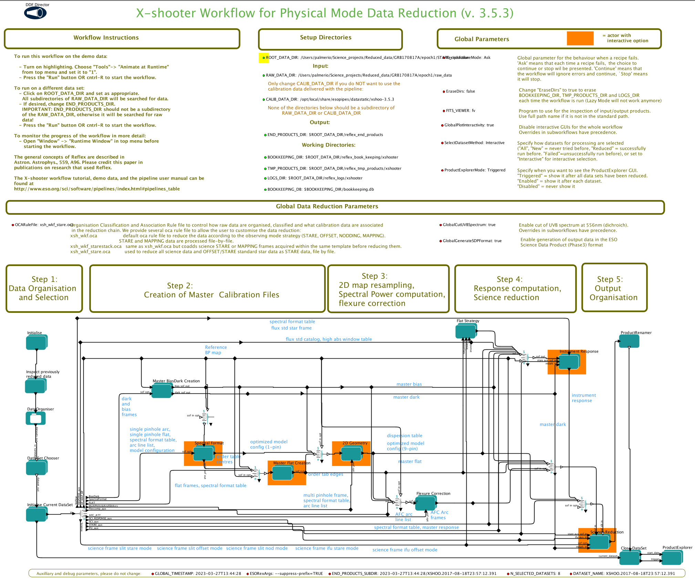

# X-shooter post processing scripts
Scripts created for post-processing [X-shooter](https://www.eso.org/sci/facilities/paranal/instruments/xshooter.html) reductions.
In particular, the scripts provided here allow to combine data taken in NODDING mode but reduced in STARE mode, as well as extract a 1D spectrum from a 2D spectrum.


I have forked this repository from [Jonatan Selsing](https://github.com/jselsing) and tidied things up for ease of use but all credit goes to him.


## Installation

To use the scripts, clone and download this repository (or download the .zip). 
```
git clone https://github.com/JPalmerio/xsh-postproc.git
```

There is a up-to-date `conda` environment file in order to install the proper python environment, which can be done with:
```
conda env create -f xsh_postproc_env.yaml
```
This will create a `conda` environment named `xsh_postproc` which you can activate with:

```
conda activate xsh_postproc
```


## Usage

The two main scripts in the package are `XSHcomb.py` and `XSHextract.py.`
These take care of combinations of individual exposures and 1D-extractions respectively.
The idea is that the ESO X-shooter pipeline is used to reduce all observations in STARE-mode, and then the scripts provided here, do combinations and extractions where the X-shooter pipeline can be improved. 

### ESO X-shooter pipeline

Install the ESO pipelines using the installation instructions available at https://www.eso.org/sci/software/pipelines/.
The building blocks of the pipeline are available as `esorex` "recipes", which can be called directly from the terminal or within scripts.
For convenience, ESO also provides a higher-level, more user-friendly graphic interface called `ESOREFLEX` to run specific collections of recipes called "workflows".
The file `xsh_workflow_stare.kar` contains a workflow which can be used with the X-Shooter pipeline, which has been preconfigured to reduce observations in STARE-mode.
If you do not want to use this workflow you can use the default X-shooter workflow and change the OCARuleFile to `xsh_wkf_stare.oca`.
To launch `ESOREFLEX` after having installed it, simply run:
```
esoreflex
```

You can then load a workflow by opening a new file with the `CMD+O` shortcut or your platform-specific equivalent.

> :warning: **Important !** You must set the `ROOT_DATA_DIR` to where you want the reduced dataset to be saved (it will be saved under `ROOT_DATA_DIR/reflex_end_products`) and don't forget to set the `RAW_DATA_DIR` to the folder containing your **_unzipped_** data.
> The recommended directory structure would look something like this:
> ```
> AT2017gfo
> └── epoch1
>     ├── STARE_reduction             # <-- ROOT_DATA_DIR
>     └── raw_data                    # <-- RAW_DATA_DIR
>         ├── M.XSHOOTER[...].fits    # All these must be unzipped !  
>         ├── ...                     #         ...
>         └── XSHOO[...].fits         #         ...
> ```


When `ESOREFLEX` is launched and the workflow loaded, it should look something like this:




During processing of the workflow, two quality-control windows are shown:

- **The flux-standard reduction**, where the response function is computed.
This window should be inspected for agreement between the blue and the green lines, signifying that the standard star has been adequately calibrated.
The blue line is the nightly, flux-calibrated standard star and the green line tabulated flux for this star. 

- **The science object reduction**, where mainly the sky regions should be set for each element in the nodding sequence.
It could look something like this, where a faint trace of the afterglow is visible, centered at -2.5 arcsec.
The sky is specified using the sky_position and sky-hheight. For this example, two sky windows have been chosen, one at 2 arcsecond with a half-height of 3 arcseconds, and one at -5 arcsec with a 1 arcsec half-height.

Note: for the workflow provided in `xsh_workflow_stare.kar`, we've actually disabled the first quality control window so you should see only one.

Here is an example of such a window:


### Sorting the ESOREFLEX outputs
By reducing data acquired in NODDING with a STARE mode reduction, each complete nodding sequence will produce 4 individual reductions (A,B,B,A) for each arm.
The scripts provided in this repository aim to combine these individual reductions into one final product.

> :warning: **Important !**
> The recommended directory structure would now look something like this:
> ```
> AT2017gfo
> └── epoch1
>     ├── STARE_reduction                         # <-- ROOT_DATA_DIR
>     │   ├── reflex_book_keeping
>     │   │   └── xshooter
>     │   │       └── ...
>     │   ├── reflex_end_products                 # Everytime you re-run ESOREFLEX it creates a new directory inside here 
>     │   │   └── ...                          
>     │   ├── reflex_logs
>     │   │   └── xshooter
>     │   │       └── ...
>     │   └── reflex_tmp_products
>     │       └── xshooter
>     │           ├── ...
>     │           └── xsh_scired_slit_stare_1     # This folder is important !
>     │               └── ...
>     └── raw_data                                # <-- RAW_DATA_DIR
>         ├── M.XSHOOTER[...].fits                # Containing all the unzipped raw data
>         ├── ...
>         └── XSHOO[...].fits
> ```

After running `ESOREFLEX`, reducing the data and before moving any files from the output, run the following script from the `py` folder:
```
python xshpp_sort_esoreflex_stare_output.py {ESOREFLEX_ROOT_DATA_DIR}
```
where `{ESOREFLEX_ROOT_DATA_DIR}` is the `ROOT_DATA_DIR` you provided in the `ESOREFLEX` workflow (omit the surrounding `{}` brackets and don't forget the `/` at the end).
In our example this would be the path up to `STARE_reduction`.


> :bulb: **Tip:** Try to reduce all products in one go. 
> The reason for this is that each time you make a new reduction, `ESOREFLEX` creates a new output directory for the end products, named after the time that you started the reduction.
> But it does not create the same directory for the temporary files which are needed to run the post-processing script!
> This means associating the temporary files with their correct reduction is not trivial.

This will ensure that all files are sorted in the right directory structure that the following scripts expect.


### Combining 2D data
To combine the individual 2D nodding frames reduced in STARE mode, run (from the `py` folder):

```
python XSHcomb.py {ESOREFLEX_ROOT_DATA_DIR} {ARM} STARE
```
where `{ESOREFLEX_ROOT_DATA_DIR}` is the `ROOT_DATA_DIR` you provided in the `ESOREFLEX` workflow and in the sorting script above, and `{ARM}` is `UVB`, `VIS` or `NIR`.
You should then find some new files in the provided directory, in particular: `{ARM}skysub.fits` which is the sky-substracted combined 2D spectrum.

You can find more information about this script by running:
```
python XSHcomb.py -h
```

### Extracting a 1D spectrum from the combined data
To extract a 1D spectrum from the 2D combined spectrum, run (from the `py` folder):

```
python XSHextract.py {ESOREFLEX_ROOT_DATA_DIR}/{ARM}skysub.fits 
```
You can find the output file as `{ARM}skysubstdext.dat` (or `{ARM}skysuboptext.dat` if you used the `--optimal` option).

You can find more information about this script by running:
```
python XSHextract.py -h
```


## License
-------
These scripts are all written by [Jonatan Selsing](https://github.com/jselsing), I have only rewritten the documentation and simplified some things.


Copyright 2016-2020 Jonatan Selsing and contributors.

These scripts are free software made available under the GNU License. For details see
the LICENSE file.

